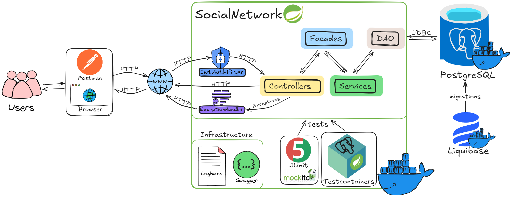

# Социальная сеть
## Описание проекта
Это серверная часть социальной сети, реализованная как RESTful API на Spring Boot. Проект предоставляет функциональность для общения пользователей, управления профилями и взаимодействия в сообществах.

## Основные возможности
### Управление пользователями
- Регистрация новых пользователей (обычных и администраторов)
- Редактирование личной информации
- Поиск пользователей по параметрам (фамилия, имя, возраст, пол)
- Система друзей (запросы, подтверждение, удаление)
- Просмотр профилей других пользователей

### Общение
- Личные сообщения между двумя пользователями
- Групповые чаты
- Публичные сообщения на "стене" пользователя
- Комментарии к публикациям
- Реакции к комментариям

### Сообщества
- Создание и управление сообществами
- Публикации на стенах сообществ
- Вступление и выход из сообществ
- Новостная лента со свежими постами друзей и сообществ

## Технологический стек
- **Язык программирования**: Java 17
- **Фреймворк**: Spring Boot 3.4
- **База данных**: PostgreSQL
- **ORM**: Hibernate/JPA
- **Безопасность**: Spring Security
- **Сборка**: Maven
- **Тестирование**: JUnit 5, Mockito, TestContainers
- **Документация API**: Swagger/OpenAPI
- **Логирование**: Logback
- **Валидация**: Hibernate Validator
- **Миграции БД**: Liquibase
- **Контейнеризация**: Docker, Docker-compose

## Архитектурные принципы
Проект разработан с соблюдением современных стандартов:
- MVC архитектура
- Принципы SOLID
- Стратегия наследования Hibernate
- Модульная структура пакетов
- Использование DTO для API
- Гибкая система обработки ошибок
- Многоуровневое логирование


## 📟 Диаграмма компонентов приложения



## 📌 Диаграмма базы данных


## Установка и запуск
### Требования
- Установленный Docker и Docker-compose

### Инструкции по развертыванию
Клонировать репозиторий:
```bash
git clone https://github.com/nemk0ff/SenlaProject.git
cd SenlaProject
```
Запустить все сервисы одной командой:

```bash
docker-compose up --build
```
Эта команда автоматически:
- Соберет образ Java-приложения
- Запустит PostgreSQL в отдельном контейнере
- Применит миграции Liquibase
- Запустит само приложение

Приложение будет доступно на: http://localhost:8080

Документация API (Swagger UI): http://localhost:8080/swagger-ui.html

 Для остановки проекта:
```bash
docker-compose down
```
## Тестирование
Проект включает:
- Unit-тесты для сервисов и контроллеров
- Интеграционные тесты с TestContainers
- Тестовые данные для проверки функциональности

Запуск тестов: `mvn test`
